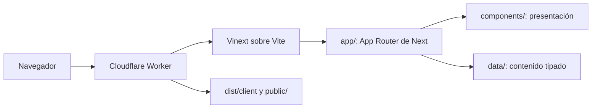
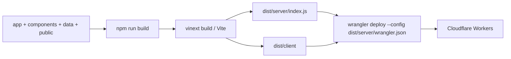

# Arquitectura de OKEY SUITES

## Flujo de una visita



Cloudflare recibe la petición. El Worker generado por Vinext resuelve la ruta de App Router y renderiza los Server Components. Los componentes que requieren estado o APIs del navegador (`MobileMenu`, `HeroCarousel`, `GalleryModal` y `PropertyCatalog`) se hidratan en el cliente. El resto se mantiene en el servidor, por lo que no añade JavaScript de interacción innecesario.

La navegación usa `Link`, que intencionadamente devuelve un `<a>` normal. Esto conserva enlaces copiables, pestañas nuevas y navegación fiable incluso antes de cargar JavaScript en esta combinación de Vinext y Cloudflare.

## Rutas

| Ruta | Implementación |
| --- | --- |
| `/` | Portada, destacados, destinos y CTA. |
| `/alojamientos` | Catálogo filtrable en cliente; acepta `?categoria=`. |
| `/alojamientos/[slug]` | Ficha individual o ficha de colección; genera parámetros estáticos conocidos y conserva slugs antiguos internamente. |
| `/contacto` | Teléfono y enlace de WhatsApp desde `siteContent`. |
| `/sobre-key-suites` | Página institucional con datos centralizados. |
| `/espectaculos`, `/restaurantes` | `ComingSoonPage` con contenido independiente. |
| `/granada`, `/villas` | Redirecciones compatibles hacia el catálogo filtrado. |

`generateStaticParams` enumera alojamientos y colecciones. `generateMetadata` toma el título, descripción e imagen de cada elemento. Cuando no existe un slug, `notFound()` evita renderizar una ficha inválida.

## Datos y presentación

```mermaid
flowchart TB
  Site[data/site-content.ts] --> Layout[layout + páginas generales]
  Properties[data/properties.ts] --> Catalog[PropertyCatalog]
  Properties --> Detail[Ficha /alojamientos/[slug]]
  Config[data/config.ts] --> Review[avisos y carrusel]
  Public[public/properties] --> Images[next/image]
```

- `site-content.ts` concentra textos transversales, navegación, SEO, portada, contacto y secciones próximas.
- `properties.ts` define el modelo `Property`/`PropertyGroup`, el catálogo visible, imágenes, avisos y compatibilidad de slugs anteriores.
- `config.ts` contiene dos decisiones globales: `REVIEW_MODE` y `CAROUSEL_INTERVAL_MS`.
- `PLANTILLA_ALOJAMIENTO.ts` es una referencia tipada deliberadamente fuera del catálogo para que no se publique.

No hay estado global, contextos ni capa de acceso a datos: los datos son constantes locales porque el catálogo es estático y pequeño.

## Componentes compartidos

`Header` y `Footer` viven en el layout raíz. `PropertyCard` y `PropertyGroupCard` se reutilizan en portada, catálogo y colecciones. `TextLines` evita repetir el renderizado de títulos con saltos explícitos. `ReviewNotice` y `PendingPhoto` se agrupan porque ambos expresan información todavía no validada.

La página de detalle mantiene pequeños componentes locales (`PropertyGallery`, `ReviewPanel`, `PlatformLinks`, `Reputation` y tarjetas de dato) porque solo pertenecen a esa ruta. Sacarlos a archivos aislados aumentaría navegación y props sin ganar reutilización real.

## Estilos y responsive

`app/personalizar-diseno.css` declara tokens editables con CSS variables. `app/globals.css` contiene las reglas de estructura, componentes y breakpoints. Se mantiene una estrategia con tres rangos principales:

- Escritorio: más de 980 px.
- Tableta y menú móvil: hasta 980 px.
- Teléfono: hasta 720 px; hay ajustes puntuales para 430 y 350 px cuando el contenido lo necesita.

La interfaz móvil no duplica páginas ni componentes: el mismo HTML cambia con CSS. En móvil se ocultan detalles secundarios del aviso de revisión y de la lista de destinos, se muestra una columna de tarjetas, las acciones de contacto ocupan toda la anchura, la galería usa una imagen principal y la reserva queda accesible mediante una barra sticky en fichas.

## Build y despliegue



`vite.config.ts` carga `vinext()` y `@cloudflare/vite-plugin`. El plugin recibe una configuración local con `nodejs_compat` y no declara D1 ni R2 porque la web no los usa. También guarda de forma local los logs y registros de Wrangler/Miniflare para que no se mezclen con archivos de proyecto.

`wrangler.jsonc` de la raíz describe la salida esperada por Cloudflare y `vinext build` genera otro `dist/server/wrangler.json`, que es el que usa el script `deploy:cloudflare`. Por ello ambos ficheros deben conservarse: uno documenta/configura el proyecto y el otro se deriva de la compilación.

`next.config.ts`, aunque vacío, se conserva como punto compatible de configuración que Vinext carga junto al proyecto Next. `tsconfig.json` conserva el plugin de Next, los tipos de Worker y el alias `@/`, usados respectivamente por herramientas de Next/Vinext, Cloudflare y los imports del código.

## Decisiones deliberadas

- No se han migrado rutas, textos, imágenes ni enlaces de reserva.
- No se han eliminado dependencias de Vinext/Vite/Cloudflare por inferencia: los peers de Vinext y los imports de Vite exigen mantenerlos como dependencias directas.
- Los assets no referenciados de forma estática se conservan si pueden actuar como favicon, marca o material de un alojamiento. Una ruta construida desde datos no siempre es detectable con una búsqueda de texto.
- `dist/`, `.next/`, `.vinext/`, `.wrangler/`, `node_modules/` y `*.tsbuildinfo` son resultados locales ignorados; no forman parte del código fuente.
